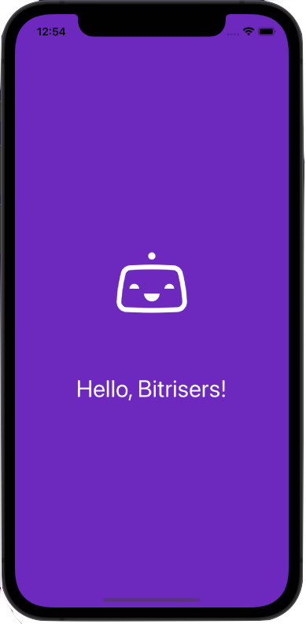

# iOS Sample App - Hello World

This is a simple iOS (Swift) app with a single view. The intention of this application is to demonstrate the usage of the mobile CI/CD functionality within [Bitrise](https://bitrise.io).

    <kbd>
        
    </kbd>

## Usage

The intention of this app is to be used with Bitrise. To use this application with Bitrise please do the following:

1. Fork (or copy, for other source control platforms) this repository to your source control account.  
2. [Create a new account or log into an existing account.](https://app.bitrise.io/users/sign_up)
3. [Create a new Bitrise project](https://devcenter.bitrise.io/en/getting-started.html#signing-up-for-bitrise-72050) using this project.
4. Start building!

## Helpful Resources

* [Official Documentation](https://devcenter.bitrise.io/)
* [Bitrise Blog](https://blog.bitrise.io)
* [Bitrise YouTube](https://www.youtube.com/c/bitriseio)

## Support and Contribution

Please feel free to submit PR's, issues or requests to this project directly.

If you have any other questions, comments, or looking for more information on Bitrise please check out:

* [Bitrise Public Slack](https://chat.bitrise.io/)
* [Bitrise Community Forums](https://discuss.bitrise.io/)

Or reach out to us directly via:

* [letsconnect@bitrise.io](mailto:developers@mariadb.com)
* [Bitrise Twitter](https://twitter.com/bitrise)

## License 
